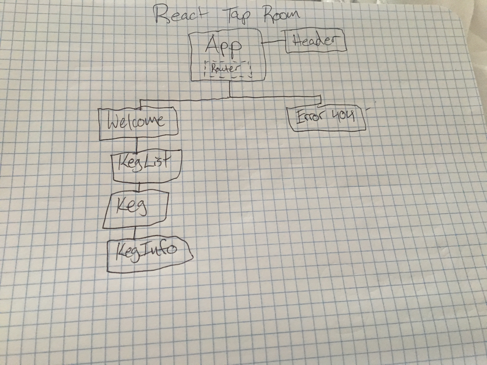

# _Tap Room Rebuild_

#### _Rebuild old AngularJS project in React_

#### By _** Isaac Shoman**_

## Description

_The original prompt was to create a CRUD web application for an imaginary tap room. This new project is to recreate that old application using React instead of using Angular.  It's been awhile since I built anything in Angular, but I have noticed that it takes a lot more time to build out the component structure in React. Mostly because I'm still not 100% confident in how small the components should be so I often second guess myself. Angular also offers CLI commands for building basic component structure which my environment does not have_

# Project Structure

* I removed the employee component as I wasn't going to build out its functionality. I also removed the editKeg and SellPint button components as they weren't functional either.

## Notes

 * Even during the first look at the angular application I can see that the cards that have the kegs on them will need to be broken down into a bunch of smaller components rather than a single component like it is in angular.
 * Really concentrating on how small of components to make. i.e. Does keg price need to be its own component? Or can I just include that in a prop-type for keg info?
 * I decided on the following organization strategy for my components in Atom:
        src
          |__ index.jsx
          |__ assets
          |__ components
                |__ App.jsx
                |__ KegList
                      |__ KegList.jsx
                      |__ Keg
                          |__ Keg.jsx
                          |__ KegItems
                              |__ EditKeg.jsx
                              |__ KegInfo.jsx
                              |__ SellPint.jsx
    My reason for this was an attempt to keep related component pieces together in a directory. For example, the Keg Items directory contains all the pieces of the Keg component.

 * Having to decide on a different layout for employees vs consumers. Allows for reuse of keg-list component with addition of edit/add buttons and functionality.
 * Goal is to get Welcome Page functionality finished with minimal styling.
 * Unable to figure out how to get images to display using base64 and mapping through my object array.

## Setup/Installation Requirements

* _Clone Repository to Desktop_
* _Navigate to directory in Terminal_
* _Run npm install_
* _Run npm start_
* _Project will open browser window and localhost:8080_

## Known Bugs

_Images not displaying properly_

## Support and Contact Details

_You may email me at isaac.shoman@gmail.com with any questions or feedback_

## Technologies Used

* _ReactJS_
* _React-Router_

### License

*This website is licensed under an MIT License*

Copyright (c) 2018 **_Isaac Shoman_**
