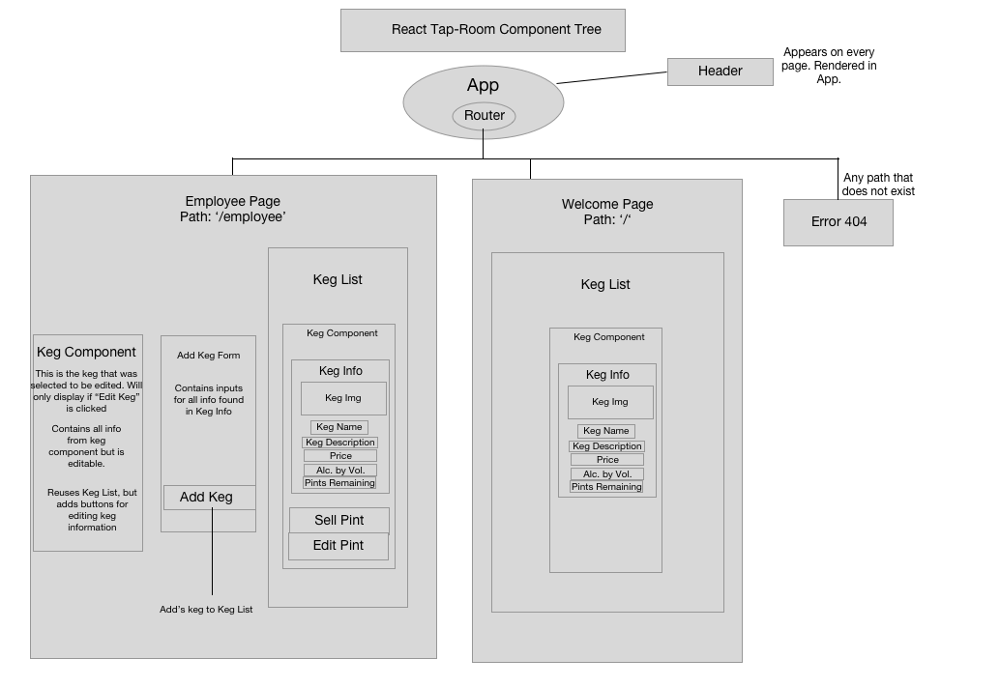

# _Tap Room Rebuild_

#### _Rebuild old AngularJS project in React_

#### By _** Isaac Shoman**_

## Description

_The original prompt was to create a CRUD web application for an imaginary tap room. This new project is to recreate that old application using React instead of using Angular._

# Project Structure

* I wasn't 100% sure how to structure the employee page as far as having components that hide and show when buttons are clicked. I also wasn't sure how data will be passed through input and such so I just generally said that there would be an add form for adding new kegs to the list.

## Notes

 * Even during the first look at the angular application I can see that the cards that have the kegs on them will need to be broken down into a bunch of smaller components rather than a single component like it is in angular.
 * Really concentrating on how small of components to make. i.e. Does keg price need to be its own component? Or can I just include that in a prop-type for keg info?
 * Having to decide on a different layout for employees vs consumers. Allows for reuse of keg-list component with addition of edit/add buttons and functionality.
 * Goal is to get Welcome Page functionality finished with minimal styling.

## Setup/Installation Requirements

* _Clone Repository to Desktop_
* _Navigate to directory in Terminal_
* _Run npm install_
* _Run npm start_
* _Project will open browser window and localhost:8080 _

## Known Bugs

_No known bugs_

## Support and Contact Details

_You may email me at isaac.shoman@gmail.com with any questions or feedback_

## Technologies Used

_ReactJS_
_React-Router_

### License

*This website is licensed under an MIT License*

Copyright (c) 2018 **_Isaac Shoman_**
